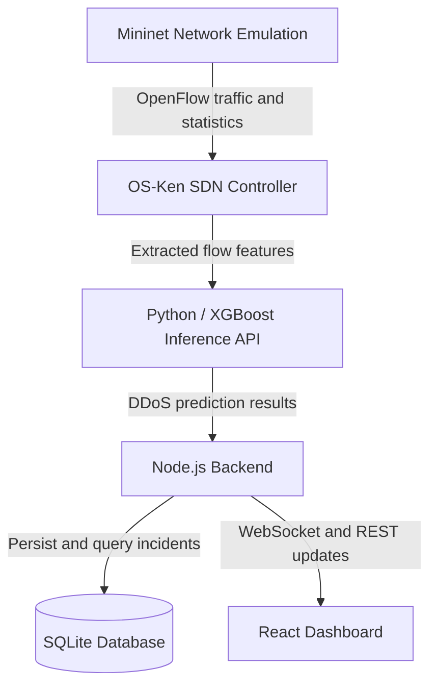

# 🛡️ SYNGUARD
**Intelligent Software-Defined Networking (SDN) Intrusion Detection System**


## 📖 About The Project
SYNGUARD is a software-defined networking project for detecting and mitigating L4 DDoS traffic in a Mininet environment. It combines an OS-Ken controller, a Python/XGBoost inference service, a Node.js backend, and a React dashboard for traffic monitoring and incident visualization. 

The backend, inference service, and dashboard use Docker Compose. Mininet and the SDN controller run on the host, so the complete simulation requires a compatible Linux environment.

## ✨ Key Features
* **Real-Time Traffic Analysis:** Collects flow statistics for traffic classification and monitoring.
* **AI-Powered Detection:** Uses XGBoost to classify network flow features as normal or DDoS traffic.
* **Containerized Application Services:** Docker Compose runs the backend, inference service, and dashboard.
* **Persistent Incident Logs:** A volume-backed SQLite database retains incident records across container restarts.
* **Live Dashboard:** React/Vite-based modern UI with WebSocket integration for live attack visualization and management.

## 🏗️ System Architecture



1. **Network Layer:** Mininet generates realistic benign and malicious traffic.
2. **Control Layer:** OS-Ken SDN Controller captures flow statistics and routes them to the AI engine.
3. **AI Layer:** The Python API classifies extracted flow features using the XGBoost model.
4. **Backend & Database:** Node.js logs the incidents into a persistent SQLite volume and broadcasts WebSocket alerts.
5. **Presentation Layer:** The React dashboard visualizes the data for the on-duty admin.

## 📊 Model Performance

The project evaluation reports the following XGBoost results. These are dataset-specific results, not a guarantee of performance on unseen networks.

| Metric | Reported value |
| --- | ---: |
| Accuracy | 99.6% |
| Precision | 99.2% |
| Recall | 100% |
| F1-score | 99.6% |
| ROC-AUC | 1.000 |


### Evaluation context

The evaluation script uses `TCP-SYNC DATASET.csv`, removes infinite and missing values, and selects four flow features: `Flow Pkts/s`, `Flow Byts/s`, `Pkt Size Avg`, and `Flow IAT Mean`. Labels containing `DDOS` are mapped to the attack class. It reserves 15% of rows with `random_state=42` and evaluates a previously saved model.

A split made when evaluating a saved model does not by itself establish an independent test set. The model's training rows must be excluded from evaluation, and related flows from the same capture or traffic-generation session should be kept in the same split. The training/evaluation overlap and session independence have not been established here. For reproducible benchmarking, record the dataset source and version, class counts, training split, model artifact, and evaluation script together.

## 📸 Screenshots

### 🔐 Login Screen


### 🚨 Live Traffic & Incident Logs


### 🕸️ SDN Topology Map


### 💻 OS-Ken SDN Controller Terminal


### 👥 User Management


## 🚀 Quick Start

### Prerequisites
* Docker & Docker Compose
* Git
* A Linux host or Linux VM with Mininet and Open vSwitch
* OS-Ken and the host-side Python dependencies required by the controller
* A graphical terminal environment if using the multi-terminal launch script

### Installation
**1. Clone the repository**

```bash
git clone https://github.com/umtoztrk/SynGuard-SDN.git
cd SynGuard-SDN
```
**2. Start the Dockerized Services (Backend, AI, UI, Database)**

```bash
docker compose up -d --build
```
**3. Launch the SDN & Network Simulation**

Open a new terminal on your host machine and run the initialization script. This will clean up previous artifacts and automatically spawn separate terminal windows for the SDN Controller and Mininet Topology:
```bash
./start.sh
```
**4. Generate and Trigger Network Traffic**

Once Mininet is ready, run the traffic scenario generator in a host terminal from the repository directory:

```bash
./generate_traffic.sh
```

Then run the generated scenario in the **Mininet CLI**:

```text
mininet> source scenario.cli
```
**5. Access the Live Dashboard**

Open your browser and navigate to the monitoring UI to watch the AI detect and mitigate the attacks in real-time:
http://localhost:5173

## 📂 Folder Structure
```text
SYNGUARD/
├── api_server_xgboost.py       # AI Engine (XGBoost prediction API)
├── sdn_controller.py           # OS-Ken SDN Manager/Controller script
├── start.sh                    # Automated Launch sequence (SDN & Mininet)
├── generate_traffic.sh         # Mininet Traffic Generator setup
├── attack_traffic.sh           # DDoS attack simulation script
├── benign_traffic.sh           # Normal network behavior simulation script
├── scenario.cli                # Mininet CLI automated commands
├── docker-compose.yml          # Container orchestration configuration
├── Dockerfile                  # Root Docker configuration
├── requirements.txt            # Python dependencies for AI and SDN
├── .gitignore                  # Git ignore rules (protects DB & cache)
├── xgboost_model.json          # Compiled XGBoost model weights
└── synguard-dashboard/         # Full Stack Application
    ├── backend/                # Node.js Server & SQLite DB Logic
    │   ├── server.js           # Main API and WebSocket server
    │   ├── db.js               # Database configuration
    │   └── Dockerfile          # Backend container setup
    └── frontend/               # React/Vite User Interface
        ├── src/                # UI source code and components
        └── Dockerfile          # Frontend container setup
```

## 🔧 Troubleshooting

* **Dashboard unavailable:** Check `docker compose ps` and `docker compose logs --tail=100`. Confirm the application services are running before opening the dashboard.
* **Permission denied when launching a script:** Run `chmod +x start.sh generate_traffic.sh attack_traffic.sh benign_traffic.sh` from the repository directory.
* **No simulated traffic:** Verify that the controller and Mininet started successfully and that `source scenario.cli` was entered in the Mininet CLI, not the host shell.

## 🤝 Contributing
Contributions, issues, and feature requests are welcome! Feel free to check the issues page.
